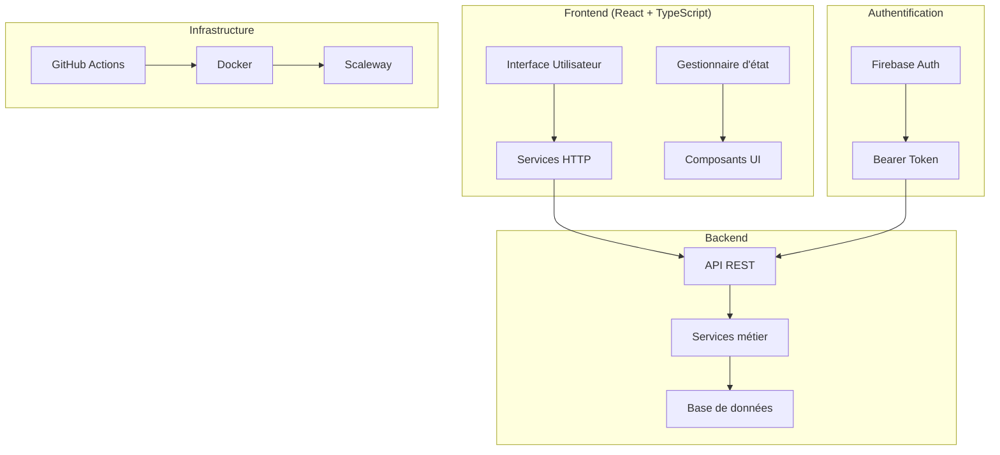
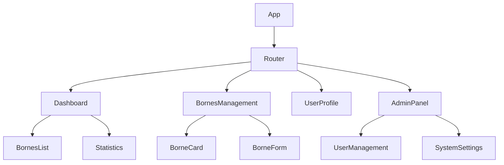
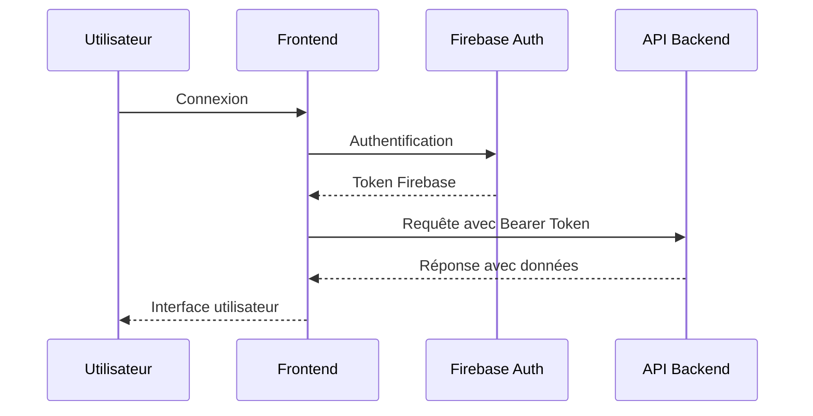
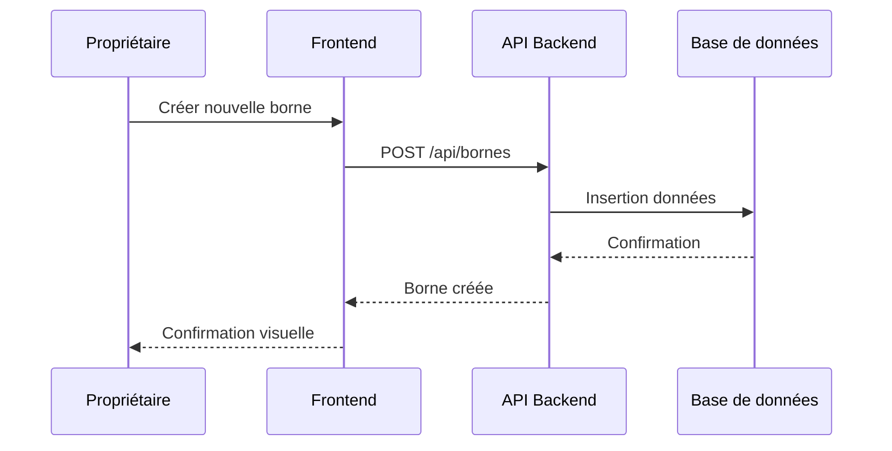

# Documentation Technique - Projet Bornes Connectées

## Table des Matières

1. [Vue d'ensemble du projet](#vue-densemble-du-projet)
2. [Architecture technique](#architecture-technique)
3. [Description fonctionnelle](#description-fonctionnelle)
4. [Guide d'installation et développement](#guide-dinstallation-et-développement)
5. [Standards de code](#standards-de-code)
6. [Authentification et sécurité](#authentification-et-sécurité)
7. [Procédures de déploiement](#procédures-de-déploiement)
8. [État du projet et roadmap](#état-du-projet-et-roadmap)
9. [Maintenance et support](#maintenance-et-support)

---

## Vue d'ensemble du projet

### Objectif
Ce projet vise à développer une plateforme de gestion de bornes connectées permettant aux propriétaires de bornes, aux administrateurs et aux développeurs de gérer efficacement un parc de bornes électriques connectées.

### Public cible
- **Développeurs** : Maintenance et évolution du projet
- **Administrateurs** : Gestion du parc informatique des bornes connectées
- **Propriétaires de bornes** : Gestion de leur parc interne de bornes connectées

### Technologies principales
- **Frontend** : React avec TypeScript
- **Backend** : API REST (déjà développée)
- **Authentification** : Firebase Auth
- **Infrastructure** : Scaleway (Docker)
- **CI/CD** : GitHub Actions (en cours d'implémentation)

---

## Architecture technique

### Architecture générale



### Architecture Frontend

#### Structure des composants



#### Services HTTP

Les services HTTP gèrent les communications avec l'API backend :

```typescript
// Example: BorneService.ts
export class BorneService {
  private baseUrl = process.env.REACT_APP_API_URL;
  
  async getBornes(): Promise<Borne[]> {
    const response = await fetch(`${this.baseUrl}/api/bornes`, {
      headers: {
        'Authorization': `Bearer ${this.getToken()}`,
        'Content-Type': 'application/json'
      }
    });
    return response.json();
  }
  
  async createBorne(borne: CreateBorneDto): Promise<Borne> {
    const response = await fetch(`${this.baseUrl}/api/bornes`, {
      method: 'POST',
      headers: {
        'Authorization': `Bearer ${this.getToken()}`,
        'Content-Type': 'application/json'
      },
      body: JSON.stringify(borne)
    });
    return response.json();
  }
  
  private getToken(): string {
    // Récupération du token Firebase
    return localStorage.getItem('firebaseToken') || '';
  }
}
```

### Architecture Backend

#### API REST
L'API REST est déjà développée et fournit les endpoints nécessaires pour :
- Gestion des bornes
- Authentification et autorisation
- Gestion des utilisateurs
- Monitoring et statistiques

#### Système d'autorisation
- **Authentification** : Firebase Auth
- **Autorisation** : Bearer Token côté API
- **Rôles actuels** : Admin, Utilisateur
- **Rôles à venir** : Développeur, Propriétaire

---

## Description fonctionnelle

### Fonctionnalités principales

#### Pour les Propriétaires de Bornes
- **Tableau de bord** : Vue d'ensemble du parc de bornes
- **Gestion des bornes** : Ajout, modification, suppression
- **Monitoring** : État en temps réel des bornes
- **Historique** : Consultation des données d'usage
- **Alertes** : Notifications en cas de problème

#### Pour les Administrateurs
- **Gestion des utilisateurs** : Création, modification, suppression
- **Gestion des rôles** : Attribution et modification des permissions
- **Monitoring système** : Surveillance de l'infrastructure
- **Configuration** : Paramétrage global du système
- **Rapports** : Génération de rapports d'usage

#### Pour les Développeurs
- **Outils de debugging** : Accès aux logs et métriques
- **Gestion des versions** : Suivi des déploiements
- **Tests** : Interface de test des fonctionnalités
- **Documentation** : Accès à la documentation technique

### Workflows utilisateur

#### Workflow d'authentification


#### Workflow de gestion des bornes


---

## Guide d'installation et développement

### Prérequis

#### Environnement de développement
- **Node.js** : Version 18 ou supérieure
- **npm** ou **yarn** : Gestionnaire de paquets
- **Git** : Contrôle de version
- **Docker** : Pour le déploiement local (optionnel)

#### Comptes et services
- **Firebase** : Compte configuré pour l'authentification
- **Scaleway** : Accès à l'infrastructure (pour le déploiement)

### Installation

#### 1. Clonage du repository
```bash
git clone https://github.com/votre-org/bornes-connectees.git
cd bornes-connectees
```

#### 2. Installation des dépendances
```bash
npm install
# ou
yarn install
```

#### 3. Configuration de l'environnement
Créer un fichier `.env` à la racine du projet :

```env
# Configuration API
REACT_APP_API_URL=https://api.bornes-connectees.com
REACT_APP_ENVIRONMENT=development

# Configuration Firebase
REACT_APP_FIREBASE_API_KEY=your-api-key
REACT_APP_FIREBASE_AUTH_DOMAIN=your-project.firebaseapp.com
REACT_APP_FIREBASE_PROJECT_ID=your-project-id
REACT_APP_FIREBASE_STORAGE_BUCKET=your-project.appspot.com
REACT_APP_FIREBASE_MESSAGING_SENDER_ID=123456789
REACT_APP_FIREBASE_APP_ID=1:123456789:web:abcdef123456789

# Configuration de développement
REACT_APP_DEBUG=true
REACT_APP_LOG_LEVEL=debug
```

#### 4. Démarrage du serveur de développement
```bash
npm start
# ou
yarn start
```

L'application sera accessible à l'adresse `http://localhost:3000`

### Structure du projet

```
bornes-connectees/
├── public/
│   ├── index.html
│   └── favicon.ico
├── src/
│   ├── components/
│   │   ├── common/
│   │   ├── bornes/
│   │   ├── users/
│   │   └── admin/
│   ├── services/
│   │   ├── BorneService.ts
│   │   ├── UserService.ts
│   │   └── AuthService.ts
│   ├── hooks/
│   │   ├── useAuth.ts
│   │   └── useBornes.ts
│   ├── types/
│   │   ├── Borne.ts
│   │   ├── User.ts
│   │   └── Api.ts
│   ├── utils/
│   │   ├── constants.ts
│   │   └── helpers.ts
│   ├── styles/
│   │   └── globals.css
│   ├── App.tsx
│   └── index.tsx
├── tests/
│   ├── components/
│   └── services/
├── docs/
├── .env
├── .gitignore
├── package.json
├── tsconfig.json
└── README.md
```

### Développement

#### Création d'un nouveau composant
```typescript
// src/components/bornes/BorneCard.tsx
import React from 'react';
import { Borne } from '../../types/Borne';

interface BorneCardProps {
  borne: Borne;
  onEdit: (id: string) => void;
  onDelete: (id: string) => void;
}

export const BorneCard: React.FC<BorneCardProps> = ({ 
  borne, 
  onEdit, 
  onDelete 
}) => {
  return (
    <div className="borne-card">
      <h3>{borne.nom}</h3>
      <p>État: {borne.etat}</p>
      <p>Localisation: {borne.localisation}</p>
      <div className="actions">
        <button onClick={() => onEdit(borne.id)}>
          Modifier
        </button>
        <button onClick={() => onDelete(borne.id)}>
          Supprimer
        </button>
      </div>
    </div>
  );
};
```

#### Création d'un service
```typescript
// src/services/UserService.ts
import { ApiService } from './ApiService';
import { User, CreateUserDto } from '../types/User';

export class UserService extends ApiService {
  async getUsers(): Promise<User[]> {
    return this.get<User[]>('/api/users');
  }
  
  async createUser(userData: CreateUserDto): Promise<User> {
    return this.post<User>('/api/users', userData);
  }
  
  async updateUser(id: string, userData: Partial<User>): Promise<User> {
    return this.put<User>(`/api/users/${id}`, userData);
  }
  
  async deleteUser(id: string): Promise<void> {
    return this.delete(`/api/users/${id}`);
  }
}
```

#### Utilisation des hooks personnalisés
```typescript
// src/hooks/useBornes.ts
import { useState, useEffect } from 'react';
import { BorneService } from '../services/BorneService';
import { Borne } from '../types/Borne';

export const useBornes = () => {
  const [bornes, setBornes] = useState<Borne[]>([]);
  const [loading, setLoading] = useState(true);
  const [error, setError] = useState<string | null>(null);
  
  const borneService = new BorneService();
  
  const fetchBornes = async () => {
    try {
      setLoading(true);
      const data = await borneService.getBornes();
      setBornes(data);
    } catch (err) {
      setError(err instanceof Error ? err.message : 'Erreur inconnue');
    } finally {
      setLoading(false);
    }
  };
  
  useEffect(() => {
    fetchBornes();
  }, []);
  
  return {
    bornes,
    loading,
    error,
    refetch: fetchBornes
  };
};
```

---

## Standards de code

### Conventions de nommage

#### TypeScript/JavaScript
- **Variables et fonctions** : camelCase
- **Composants React** : PascalCase
- **Constantes** : UPPER_SNAKE_CASE
- **Fichiers** : PascalCase pour les composants, camelCase pour les services

```typescript
// ✅ Correct
const userName = 'John Doe';
const API_BASE_URL = 'https://api.example.com';

export const BorneCard = () => { /* ... */ };
export const userService = new UserService();

// ❌ Incorrect
const user_name = 'John Doe';
const apiBaseUrl = 'https://api.example.com';
```

#### CSS
- **Classes** : kebab-case
- **BEM** : block__element--modifier

```css
/* ✅ Correct */
.borne-card {
  /* styles */
}

.borne-card__title {
  /* styles */
}

.borne-card__title--highlighted {
  /* styles */
}
```

### Structure des fichiers

#### Organisation des imports
```typescript
// 1. Imports de bibliothèques externes
import React, { useState, useEffect } from 'react';
import { BrowserRouter as Router } from 'react-router-dom';

// 2. Imports des services internes
import { BorneService } from '../services/BorneService';
import { AuthService } from '../services/AuthService';

// 3. Imports des composants
import { BorneCard } from './BorneCard';
import { LoadingSpinner } from '../common/LoadingSpinner';

// 4. Imports des types
import { Borne } from '../types/Borne';
import { User } from '../types/User';

// 5. Imports des styles
import './BornesList.css';
```

#### Déclaration des interfaces
```typescript
// Interface pour les props
interface BornesListProps {
  title: string;
  showFilters?: boolean;
  onBorneSelect?: (borne: Borne) => void;
}

// Interface pour l'état local
interface BornesListState {
  bornes: Borne[];
  filteredBornes: Borne[];
  loading: boolean;
  error: string | null;
}
```

### Gestion des erreurs

#### Try-catch pour les appels API
```typescript
const handleCreateBorne = async (borneData: CreateBorneDto) => {
  try {
    setLoading(true);
    const newBorne = await borneService.createBorne(borneData);
    setBornes(prev => [...prev, newBorne]);
    setSuccessMessage('Borne créée avec succès');
  } catch (error) {
    console.error('Erreur lors de la création:', error);
    setError(error instanceof Error ? error.message : 'Erreur inconnue');
  } finally {
    setLoading(false);
  }
};
```

#### Gestion des erreurs dans les composants
```typescript
const ErrorBoundary: React.FC<{ children: React.ReactNode }> = ({ children }) => {
  const [hasError, setHasError] = useState(false);
  
  if (hasError) {
    return (
      <div className="error-boundary">
        <h2>Une erreur s'est produite</h2>
        <button onClick={() => setHasError(false)}>
          Réessayer
        </button>
      </div>
    );
  }
  
  return <>{children}</>;
};
```

### Tests

#### Tests unitaires
```typescript
// tests/components/BorneCard.test.tsx
import { render, screen, fireEvent } from '@testing-library/react';
import { BorneCard } from '../../src/components/bornes/BorneCard';
import { Borne } from '../../src/types/Borne';

const mockBorne: Borne = {
  id: '1',
  nom: 'Borne Test',
  etat: 'active',
  localisation: 'Paris'
};

describe('BorneCard', () => {
  test('affiche les informations de la borne', () => {
    render(
      <BorneCard 
        borne={mockBorne}
        onEdit={() => {}}
        onDelete={() => {}}
      />
    );
    
    expect(screen.getByText('Borne Test')).toBeInTheDocument();
    expect(screen.getByText('État: active')).toBeInTheDocument();
    expect(screen.getByText('Localisation: Paris')).toBeInTheDocument();
  });
  
  test('appelle onEdit quand le bouton modifier est cliqué', () => {
    const mockOnEdit = jest.fn();
    render(
      <BorneCard 
        borne={mockBorne}
        onEdit={mockOnEdit}
        onDelete={() => {}}
      />
    );
    
    fireEvent.click(screen.getByText('Modifier'));
    expect(mockOnEdit).toHaveBeenCalledWith('1');
  });
});
```

---

## Authentification et sécurité

### Système d'authentification

#### Firebase Auth
L'authentification est gérée via Firebase Auth, offrant :
- Connexion par email/mot de passe
- Authentification multi-facteurs (à implémenter)
- Gestion des sessions
- Réinitialisation de mot de passe

#### Configuration Firebase
```typescript
// src/services/AuthService.ts
import { initializeApp } from 'firebase/app';
import { 
  getAuth, 
  signInWithEmailAndPassword,
  createUserWithEmailAndPassword,
  signOut,
  onAuthStateChanged
} from 'firebase/auth';

const firebaseConfig = {
  apiKey: process.env.REACT_APP_FIREBASE_API_KEY,
  authDomain: process.env.REACT_APP_FIREBASE_AUTH_DOMAIN,
  projectId: process.env.REACT_APP_FIREBASE_PROJECT_ID,
  storageBucket: process.env.REACT_APP_FIREBASE_STORAGE_BUCKET,
  messagingSenderId: process.env.REACT_APP_FIREBASE_MESSAGING_SENDER_ID,
  appId: process.env.REACT_APP_FIREBASE_APP_ID
};

const app = initializeApp(firebaseConfig);
export const auth = getAuth(app);

export class AuthService {
  async login(email: string, password: string) {
    const userCredential = await signInWithEmailAndPassword(auth, email, password);
    const token = await userCredential.user.getIdToken();
    localStorage.setItem('firebaseToken', token);
    return userCredential.user;
  }
  
  async logout() {
    await signOut(auth);
    localStorage.removeItem('firebaseToken');
  }
  
  getCurrentUser() {
    return auth.currentUser;
  }
  
  onAuthStateChange(callback: (user: any) => void) {
    return onAuthStateChanged(auth, callback);
  }
}
```

### Système d'autorisation

#### Gestion des rôles
```typescript
// src/types/User.ts
export interface User {
  id: string;
  email: string;
  nom: string;
  prenom: string;
  role: UserRole;
  permissions: Permission[];
  createdAt: Date;
  updatedAt: Date;
}

export enum UserRole {
  ADMIN = 'admin',
  UTILISATEUR = 'utilisateur',
  DEVELOPPEUR = 'developpeur', // À implémenter
  PROPRIETAIRE = 'proprietaire'  // À implémenter
}

export interface Permission {
  id: string;
  nom: string;
  description: string;
}
```

#### Hook pour la gestion des permissions
```typescript
// src/hooks/usePermissions.ts
import { useAuth } from './useAuth';
import { UserRole } from '../types/User';

export const usePermissions = () => {
  const { user } = useAuth();
  
  const hasRole = (role: UserRole): boolean => {
    return user?.role === role;
  };
  
  const hasPermission = (permission: string): boolean => {
    return user?.permissions.some(p => p.nom === permission) || false;
  };
  
  const canManageBornes = (): boolean => {
    return hasRole(UserRole.ADMIN) || 
           hasRole(UserRole.PROPRIETAIRE) ||
           hasPermission('manage_bornes');
  };
  
  const canManageUsers = (): boolean => {
    return hasRole(UserRole.ADMIN) ||
           hasPermission('manage_users');
  };
  
  return {
    hasRole,
    hasPermission,
    canManageBornes,
    canManageUsers
  };
};
```

#### Composant de protection des routes
```typescript
// src/components/auth/ProtectedRoute.tsx
import React from 'react';
import { Navigate } from 'react-router-dom';
import { useAuth } from '../../hooks/useAuth';
import { usePermissions } from '../../hooks/usePermissions';
import { UserRole } from '../../types/User';

interface ProtectedRouteProps {
  children: React.ReactNode;
  requiredRole?: UserRole;
  requiredPermission?: string;
}

export const ProtectedRoute: React.FC<ProtectedRouteProps> = ({
  children,
  requiredRole,
  requiredPermission
}) => {
  const { user, loading } = useAuth();
  const { hasRole, hasPermission } = usePermissions();
  
  if (loading) {
    return <div>Chargement...</div>;
  }
  
  if (!user) {
    return <Navigate to="/login" replace />;
  }
  
  if (requiredRole && !hasRole(requiredRole)) {
    return <Navigate to="/unauthorized" replace />;
  }
  
  if (requiredPermission && !hasPermission(requiredPermission)) {
    return <Navigate to="/unauthorized" replace />;
  }
  
  return <>{children}</>;
};
```

### Sécurité des communications

#### Intercepteur pour les requêtes API
```typescript
// src/services/ApiService.ts
export class ApiService {
  private baseUrl: string;
  
  constructor() {
    this.baseUrl = process.env.REACT_APP_API_URL || '';
  }
  
  private async request<T>(
    endpoint: string, 
    options: RequestInit = {}
  ): Promise<T> {
    const token = localStorage.getItem('firebaseToken');
    
    const config: RequestInit = {
      ...options,
      headers: {
        'Content-Type': 'application/json',
        ...(token && { Authorization: `Bearer ${token}` }),
        ...options.headers,
      },
    };
    
    const response = await fetch(`${this.baseUrl}${endpoint}`, config);
    
    if (!response.ok) {
      if (response.status === 401) {
        // Token expiré, rediriger vers la connexion
        localStorage.removeItem('firebaseToken');
        window.location.href = '/login';
      }
      throw new Error(`Erreur API: ${response.status}`);
    }
    
    return response.json();
  }
  
  protected get<T>(endpoint: string): Promise<T> {
    return this.request<T>(endpoint);
  }
  
  protected post<T>(endpoint: string, data: any): Promise<T> {
    return this.request<T>(endpoint, {
      method: 'POST',
      body: JSON.stringify(data),
    });
  }
  
  protected put<T>(endpoint: string, data: any): Promise<T> {
    return this.request<T>(endpoint, {
      method: 'PUT',
      body: JSON.stringify(data),
    });
  }
  
  protected delete<T>(endpoint: string): Promise<T> {
    return this.request<T>(endpoint, {
      method: 'DELETE',
    });
  }
}
```

---

## Procédures de déploiement

### Environnements

#### Développement
- **URL** : `http://localhost:3000`
- **Base de données** : Locale ou de développement
- **Logs** : Niveau DEBUG

#### Staging/Test
- **URL** : `https://staging.bornes-connectees.com`
- **Base de données** : Staging
- **Logs** : Niveau INFO

#### Production
- **URL** : `https://bornes-connectees.com`
- **Base de données** : Production
- **Logs** : Niveau ERROR

### Déploiement actuel (Scaleway + Docker)

#### Dockerfile
```dockerfile
# Dockerfile
FROM node:18-alpine as builder

WORKDIR /app
COPY package*.json ./
RUN npm ci --only=production

COPY . .
RUN npm run build

FROM nginx:alpine
COPY --from=builder /app/build /usr/share/nginx/html
COPY nginx.conf /etc/nginx/nginx.conf

EXPOSE 80
CMD ["nginx", "-g", "daemon off;"]
```

#### Script de déploiement
```bash
#!/bin/bash
# deploy.sh

set -e

echo "🚀 Déploiement en cours..."

# Build de l'image Docker
docker build -t bornes-connectees:latest .

# Tag pour le registry
docker tag bornes-connectees:latest registry.scaleway.com/bornes-connectees:latest

# Push vers le registry
docker push registry.scaleway.com/bornes-connectees:latest

# Déploiement sur Scaleway
echo "📦 Déploiement sur Scaleway..."
# Commandes spécifiques à Scaleway

echo "✅ Déploiement terminé!"
```

### CI/CD avec GitHub Actions (à implémenter)

#### Workflow de déploiement
```yaml
# .github/workflows/deploy.yml
name: Deploy to Production

on:
  push:
    branches: [main]
  pull_request:
    branches: [main]

jobs:
  test:
    runs-on: ubuntu-latest
    steps:
      - uses: actions/checkout@v3
      
      - name: Setup Node.js
        uses: actions/setup-node@v3
        with:
          node-version: '18'
          cache: 'npm'
      
      - name: Install dependencies
        run: npm ci
      
      - name: Run tests
        run: npm test
      
      - name: Run linting
        run: npm run lint
      
      - name: Build project
        run: npm run build

  deploy:
    needs: test
    runs-on: ubuntu-latest
    if: github.ref == 'refs/heads/main'
    
    steps:
      - uses: actions/checkout@v3
      
      - name: Setup Docker Buildx
        uses: docker/setup-buildx-action@v2
      
      - name: Login to Scaleway Registry
        uses: docker/login-action@v2
        with:
          registry: registry.scaleway.com
          username: ${{ secrets.SCALEWAY_USERNAME }}
          password: ${{ secrets.SCALEWAY_PASSWORD }}
      
      - name: Build and push Docker image
        uses: docker/build-push-action@v4
        with:
          context: .
          push: true
          tags: registry.scaleway.com/bornes-connectees:latest
          cache-from: type=gha
          cache-to: type=gha,mode=max
      
      - name: Deploy to Scaleway
        run: |
          # Commandes de déploiement Scaleway
          echo "Déploiement sur Scaleway..."
```

#### Workflow de tests
```yaml
# .github/workflows/test.yml
name: Tests

on:
  push:
    branches: [main, develop]
  pull_request:
    branches: [main, develop]

jobs:
  test:
    runs-on: ubuntu-latest
    
    strategy:
      matrix:
        node-version: [16.x, 18.x]
    
    steps:
      - uses: actions/checkout@v3
      
      - name: Use Node.js ${{ matrix.node-version }}
        uses: actions/setup-node@v3
        with:
          node-version: ${{ matrix.node-version }}
          cache: 'npm'
      
      - name: Install dependencies
        run: npm ci
      
      - name: Run tests
        run: npm test -- --coverage
      
      - name: Upload coverage to Codecov
        uses: codecov/codecov-action@v3
```

### Procédure de rollback

#### Rollback automatique
```bash
#!/bin/bash
# rollback.sh

echo "🔄 Rollback en cours..."

# Récupération de la version précédente
PREVIOUS_VERSION=$(docker images registry.scaleway.com/bornes-connectees --format "table {{.Tag}}" | sed -n '2p')

if [ -z "$PREVIOUS_VERSION" ]; then
  echo "❌ Aucune version précédente trouvée"
  exit 1
fi

echo "📦 Rollback vers la version: $PREVIOUS_VERSION"

# Redéploiement de la version précédente
docker pull registry.scaleway.com/bornes-connectees:$PREVIOUS_VERSION
docker tag registry.scaleway.com/bornes-connectees:$PREVIOUS_VERSION registry.scaleway.com/bornes-connectees:latest

# Redémarrage des services
# Commandes spécifiques à Scaleway

echo "✅ Rollback terminé!"
```

---

## État du projet et roadmap

### Fonctionnalités implémentées ✅

#### Authentification et autorisation
- ✅ Connexion via Firebase Auth
- ✅ Gestion des rôles Admin et Utilisateur
- ✅ Système de Bearer Token
- ✅ Protection des routes

#### Gestion des bornes
- ✅ Liste des bornes
- ✅ Création de nouvelles bornes
- ✅ Modification des bornes existantes
- ✅ Suppression des bornes

#### Interface utilisateur
- ✅ Dashboard principal
- ✅ Interface responsive
- ✅ Composants réutilisables
- ✅ Gestion des erreurs

#### Infrastructure
- ✅ Déploiement Docker sur Scaleway
- ✅ API REST fonctionnelle
- ✅ Base de données opérationnelle

### Fonctionnalités en développement 🚧

#### Nouveaux rôles utilisateur
- 🚧 Rôle Développeur
  - Accès aux outils de debugging
  - Consultation des logs système
  - Interface de test des API
  
- 🚧 Rôle Propriétaire
  - Gestion du parc personnel
  - Rapports d'usage détaillés
  - Paramétrage des alertes

#### Monitoring et alertes
- 🚧 Système d'alertes en temps réel
- 🚧 Tableau de bord de monitoring
- 🚧 Notifications push
- 🚧 Rapports automatisés

#### Améliorations UX/UI
- 🚧 Mode sombre
- 🚧 Personnalisation de l'interface
- 🚧 Amélioration de l'accessibilité
- 🚧 Progressive Web App (PWA)

### Fonctionnalités à implémenter 📋

#### CI/CD et DevOps
- 📋 Pipeline GitHub Actions complet
- 📋 Tests automatisés (E2E)
- 📋 Déploiement multi-environnement
- 📋 Monitoring de la performance

#### Sécurité avancée
- 📋 Authentification multi-facteurs (MFA)
- 📋 Audit des actions utilisateur
- 📋 Chiffrement des données sensibles
- 📋 Gestion des sessions avancée

#### Fonctionnalités métier
- 📋 Géolocalisation des bornes
- 📋 Planification de maintenance
- 📋 Facturation et paiements
- 📋 Intégration avec systèmes externes

#### Analytics et reporting
- 📋 Tableaux de bord avancés
- 📋 Analyse prédictive
- 📋 Export de données
- 📋 KPI et métriques métier

### Roadmap détaillée

#### Q3 2025 (Juillet - Septembre)
- **Semaine 1-2** : Implémentation des rôles Développeur et Propriétaire
- **Semaine 3-4** : Système d'alertes et monitoring
- **Semaine 5-6** : Pipeline CI/CD GitHub Actions
- **Semaine 7-8** : Tests et stabilisation
- **Semaine 9-10** : Déploiement et documentation
- **Semaine 11-12** : Retours utilisateurs et corrections

#### Q4 2025 (Octobre - Décembre)
- **Octobre** : Amélioration UX/UI et PWA
- **Novembre** : Sécurité avancée et MFA
- **Décembre** : Géolocalisation et planification

#### Q1 2026 (Janvier - Mars)
- **Janvier** : Analytics et reporting avancés
- **Février** : Intégrations externes
- **Mars** : Facturation et paiements

### Risques et mitigation

#### Risques techniques
- **Scalabilité** : Prévoir la montée en charge
- **Performance** : Optimisation continue nécessaire
- **Sécurité** : Veille sécuritaire constante

#### Risques projet
- **Dépendances externes** : Firebase, Scaleway
- **Compétences équipe** : Formation continue
- **Délais** : Priorisation des fonctionnalités

---

## Maintenance et support

### Support technique

#### Niveaux de support
- **Niveau 1** : Propriétaires de bornes (FAQ, documentation)
- **Niveau 2** : Administrateurs (tickets, chat)
- **Niveau 3** : Développeurs (debugging, patches)

#### Canaux de support
- **Documentation** : Wiki interne, GitHub Pages
- **Tickets** : Système de ticketing intégré
- **Chat** : Support en temps réel pour les admin
- **Email** : Support asynchrone

### Monitoring et logs

#### Métriques à surveiller
- **Performance** : Temps de réponse, throughput
- **Erreurs** : Taux d'erreur, erreurs critiques
- **Utilisation** : Nombre d'utilisateurs actifs, usage des fonctionnalités
- **Infrastructure** : CPU, mémoire, stockage

#### Alertes
```typescript
// Configuration des alertes
const alertConfig = {
  errorRate: {
    threshold: 5, // 5% d'erreurs
    window: '5m',
    action: 'email_admin'
  },
  responseTime: {
    threshold: 2000, // 2 secondes
    window: '5m',
    action: 'slack_notification'
  },
  uptime: {
    threshold: 99.5, // 99.5% d'uptime
    window: '1h',
    action: 'emergency_call'
  }
};
```

### Procédures de maintenance

#### Maintenance préventive
- **Hebdomadaire** : Vérification des logs, mise à jour des dépendances
- **Mensuelle** : Analyse des performances, nettoyage des données
- **Trimestrielle** : Audit sécuritaire, optimisation de la base de données

#### Maintenance corrective
- **Bugs critiques** : Correction immédiate (<2h)
- **Bugs majeurs** : Correction sous 24h
- **Bugs mineurs** : Correction dans la prochaine version

### Sauvegardes et récupération

#### Stratégie de sauvegarde
- **Données** : Sauvegarde quotidienne, rétention 30 jours
- **Configuration** : Versioning dans Git
- **Images Docker** : Archivage des versions stables

#### Plan de récupération
- **RTO** (Recovery Time Objective) : 4 heures
- **RPO** (Recovery Point Objective) : 1 heure
- **Tests** : Simulation mensuelle de récupération

---

## Conclusion

Cette documentation technique fournit une vue complète du projet de bornes connectées. Elle doit être maintenue à jour au fur et à mesure de l'évolution du projet.

### Contacts
- **Équipe développement** : dev@bornes-connectees.com
- **Support technique** : support@bornes-connectees.com
- **Administration** : admin@bornes-connectees.com

### Ressources complémentaires
- **Repository GitHub** : https://github.com/org/bornes-connectees
- **Documentation API** : https://api.bornes-connectees.com/docs
- **Environnement de test** : https://staging.bornes-connectees.com

---

*Document généré le 3 juillet 2025 - Version 1.0*